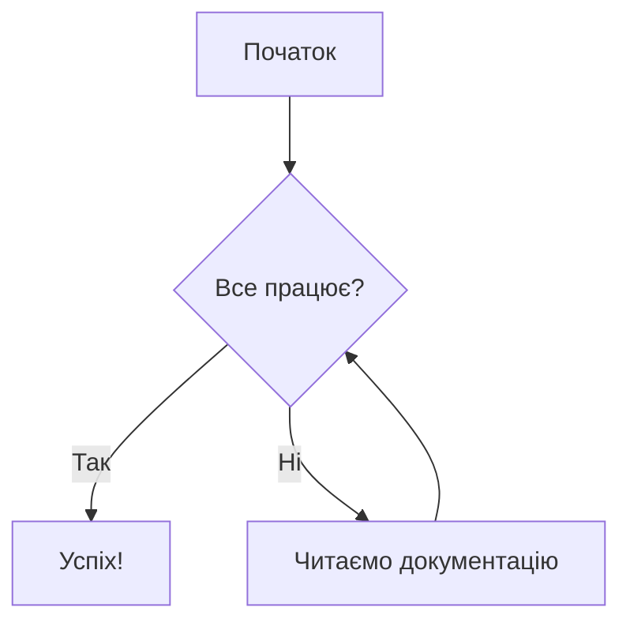

# Yelp ETL Project

---

### Популярні типи діаграм, які підтримує GitHub:

| Тип діаграми | Синтаксис (перший рядок) | Для чого підходить |
| :--- | :--- | :--- |
| **Flowchart** | `graph TD` або `graph LR` | Алгоритми та логічні схеми |
| **Sequence Diagram** | `sequenceDiagram` | Взаємодія між об'єктами/сервісами |
| **Gantt Chart** | `gantt` | Планування проєктів та дедлайни |
| **Class Diagram** | `classDiagram` | Структура класів в ООП |
| **Entity Relationship** | `erDiagram` | Структура баз даних |

### Кілька порад для GitHub:
1. **Напрямок:** Використовуйте `TD` (Top Down — зверху вниз) або `LR` (Left Right — зліва направо) для блок-схем.
2. **Стилізація:** GitHub використовує стандартну світлу або темну тему залежно від налаштувань профілю користувача. Mermaid адаптується до них автоматично.
3. **Попередній перегляд:** У веб-інтерфейсі GitHub під час редагування файлу натисніть вкладку **"Preview"**, щоб одразу побачити результат.

---

Яку саме схему ви хочете створити? Якщо ви опишете логіку, я можу написати для вас готовий код, який ви просто скопіюєте в свій GitHub репозиторій.
